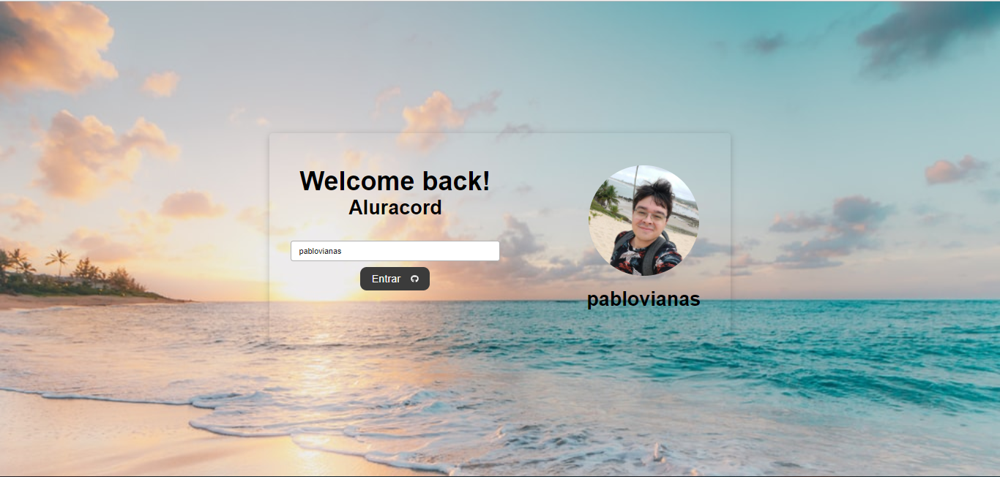
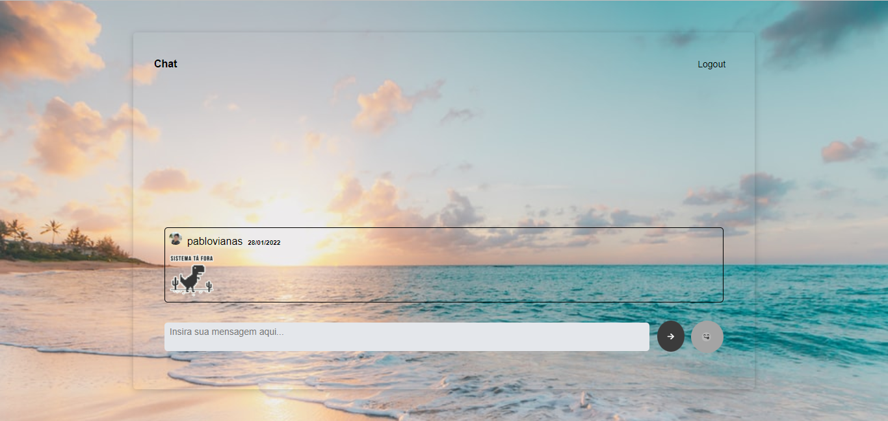

# Aluracord
A project developed on @Alura React imersion

## Project Screenshots

  
   

## Where can I find layout example for this project? 
- [Figma](https://www.figma.com/file/X5kVg1hNCajiV73ah7iyPz/Untitled?node-id=0%3A1)

## Can I test it? Sure.
- [Vercel](https://aluracord-orpin.vercel.app/)

## What about future updates?
There is still some challenges to do, for example:
- Deleting messages;
- Show profiles infos on mouse over picture;
- Edit some colors and layouts;
- Etc..
